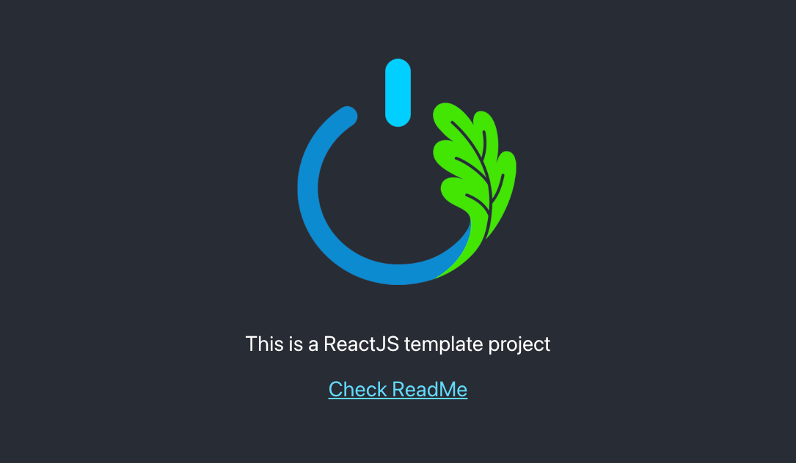

# Welcome to Oaks Solution and Studio ReactJS Project Template

This project template has been carefully crafted to provide a standardized structure for ReactJS projects developed by [Your Company Name]. It follows a well-organized layout to enhance collaboration, code maintainability, and development efficiency.

## Project Structure

The project structure is designed to keep your codebase organized and easy to navigate:

- `src` folder: The main source code directory.
  - `assets` folder: Contains all project-related assets.
    - `images` folder: Stores various image assets.
      - `full` folder: Original images reside here.
      - `process_image.bash`: Bash script to automate image conversion.
      - `ffmpeg` and `ffprobe`: Tools for image conversion.
    - `audio` folder: Audio assets.
    - `video` folder: Video assets.
    - `fonts` folder: Fonts used in the project.
  - `components` folder: Reusable UI components.
  - `pages` folder: Components representing different pages of the application.
  - `dialogs` folder: UI dialog components.
  - `configs` folder: Configuration files for the project.
  - `utilities` folder: Reusable utility functions.

## Image Processing

The `process_image.bash` script automates the image conversion process within the `images` folder. It generates multiple sizes of images and even base64-encoded versions. The process involves:

1. Images in the `full` folder are converted to various sizes:
   - Large
   - Medium
   - Small
   - Tiny
   - Preload Thumbnail

2. Base64-encoded versions of images derived from the `preload_thumb` size are generated.

## Deployment on Apache Server

If you're deploying this project on an Apache server, a `.htaccess` file has been included in the `public` folder to help with routing. This ensures that your React application works correctly with client-side routing.

## Getting Started

To use this project template for your new ReactJS project:

1. Clone this repository.
2. Customize the components, pages, and other elements based on your project requirements.
3. Utilize the automated image processing by running `process_image.bash` as needed.
4. If deploying on Apache, make sure to include the provided `.htaccess` file in the `public` folder.

## Contributing

We welcome contributions from the community! If you've found a bug, have suggestions, or want to add features, please open an issue or submit a pull request.

## License

This project is licensed under the [MIT License](LICENSE).

---

**Oaks Solution and Studio** - Creating Innovative Solutions Through Code
